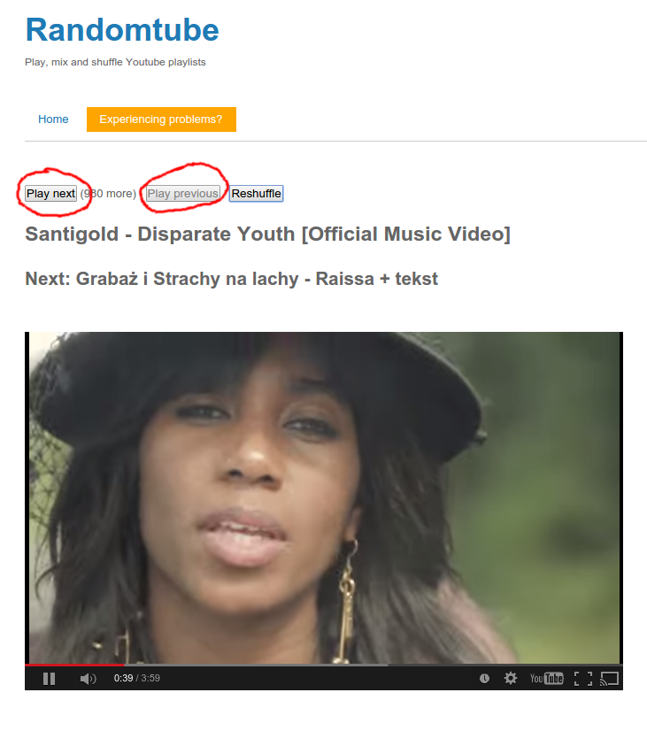

# youtube-playlist-randomizer-controller
Scripts allow controlling your http://youtube-playlist-randomizer.valami.info page from your phone!

# Descripion
First app is a simple node app which receives commands from your phone and remembers them for a while. It also tells the second script what to do when it asks.

Second one is a chrome extension that starts up only on http://youtube-playlist-randomizer.valami.info pages. It is asking questions to the first one and, whenever you want, literally clicks on 'Play next' or 'Play previous' buttons on the page.

Moreover, website script sends current and next song titles, so one can `GET` them. Also `POST` response will have a title of the song after the change.

# Requirements
- [node.js](https://nodejs.org) installed
- Chrome browser

# Installation
1. run the server
   * `cd /path/to/server/` and install dependencies by `npm i`
   * run `node /path/to/server/server.js` (ideally, add to startup apps)
2. open port 9995 (just for local network) by `sudo iptables -A INPUT -p tcp --dport 9995 -j ACCEPT` if you are on linux, or ... find out yourself how to do it in you OS (ideally, save iptables permanently)
3. install chrome extension
   * enter 'extensions'
   * enable developer mode
   * click 'load extension without packet'
   * point to '/path/to/chrome-plugin' directory and clik 'open'
4. open your http://youtube-playlist-randomizer.valami.info page
5. install [REST Client for Android](https://play.google.com/store/apps/details?id=com.sourcestream.android.restclient) if you have Android, or ... find it yourself :)
6. enjoy! by sending GET (get info), POST (next) or PUT (prev) to your computer's IP on port 9995
